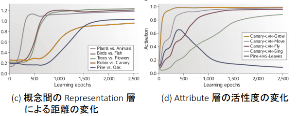

## 第3章
---
### **プライミング法, プライミング効果**
primeによってアクセスの時間が短くなる.  
つまり, 別の単語を見せることで単語を連想する時間が変化する.  
* 意味プライミング : nurse -> doctor

### **自動処理と意識的処理**

* meaning : prime, target間に関係があるか.
* expectation : targetの単語を想起させたか. 
* SOA : Stimulus-Onset Asynchrony | primeの刺激からtargetの刺激までの時間.  
* Related -> 自動処理  
* Expected -> 意識的処理

意味ネットワークや活性拡散ネットワークのリンク関係によって
プライミング効果が説明できる. 
primeによってネットワークで周りの単語が想起されやすくなる.

### **語彙的曖昧さ**
* 同音異義語 : knight-night
* 同形意義語 : desert(砂漠, noun) - desert(去る, verb)
* 多義語 : bank(銀行, 土手)

**どのように解消されるか?**
* 逐次処理モデル 
* 文脈依存処理モデル
* 並列処理モデル

**実験**

それぞれ上の赤文字が多義語. 
straw ... berry?

**クロスモーダルプライミング**

文章を音声で読み上げている途中でモニタに文字を表示し, 文字判断課題を行う.  
bugsの直後だとどちらの意味でも促進効果が得られる. 
200ms後(cor)では文脈に関係がある虫という意味のみ促進される.

**改訂並列処理モデル**  
多義語であっても複数の意味の使われる頻度が均衡か不均衡であるかによってアクセス時間が変化してくる. 
* reordered access model : 文脈が指示した意味のアクセス容易性が高まる(今の所このモデルが一番良さそう).
* autonomous access model : 文脈に関係なく, 頻度に応じて意味がアクセスされる. 

## 第4章 | ニューラルネットワーク
---
* 活性化関数
* 隠れ層による表現拡張
* 誤差逆伝播法
* autoencoder
### DNN in 言語認知工学
#### Roger and McClelland
  
Item層(入力)に単語, Relation層(第二の入力？)に関係を入力する. 
Attribute層(出力)にて属性を出力.  
単語 : pine, oak, rose, ....  
関係 : is a, is, can, ....  
属性 : living thing, pretty, grow, ....  
Representation層に意味構造が創発した！(ここがモデルの肝)  
実際にRepresentation層をクラスタ分析すると意味の
階層構造が見られた.  
  
学習過程の遷移を見てみても, まず大分類が先に学習され, 
そこからどんどん細かい分類をしていく.  
 
でもこの学習過程は人間の基本レベルの優位性に反している.   
**つまり...**  
もともとニューラルネットワークが与えられた入力に対して
どういう出力がくるのかがわかっているし, そうなるように
入力と出力の単語/属性を与えたのだけれども(恣意的！), 
その学習を通して隠れ層(Representation層)にどのような
特徴が現れるかを観察したところ意味構造を見ることができた
ということ. でも学習過程が人間と逆なのだ.  
**なので...**
基本レベルの単語の学習比率を大きくして人間のような
学習をさせよう！  
#### ニューラル言語モデル
RNNを用いてある単語列を与えたときに次に生起する
単語列を推定する.  